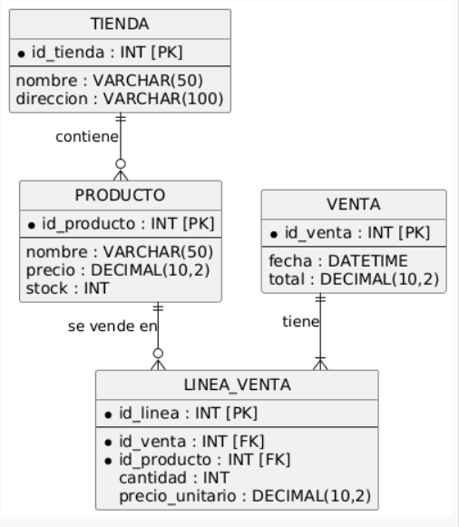
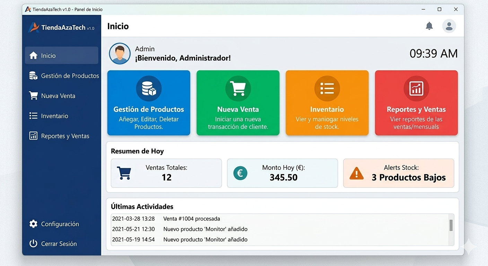

# 🚀 Oricode App - TiendaAzaTech (Gestión de Inventario y Ventas)

## 1. Descripción del Proyecto
**Oricode App (TiendaAzaTech)** es una aplicación de escritorio desarrollada en Java para el módulo de Programación. El objetivo principal de este sistema es automatizar de manera integral la gestión comercial de una tienda, permitiendo administrar el inventario de productos, controlar los niveles de stock y registrar transacciones de venta en tiempo real. 

La aplicación ofrece una solución robusta con operaciones CRUD completas y almacenamiento persistente para optimizar la toma de decisiones y el flujo de caja del negocio.

---

## 2. Estructura del Código
El código fuente del sistema está estructurado siguiendo los principios de la programación orientada a objetos (POO) y buenas prácticas modulares en el directorio `src/`:

* **`mainTiendaApp`**: Clase principal que contiene el método `main` para inicializar y arrancar la aplicación.
* **`TiendaAzaTech`**: Clase núcleo que gestiona la información general de la tienda (nombre, dirección).
* **`GestorProductos`**: Componente lógico encargado de la gestión CRUD (agregar, eliminar, modificar y buscar productos) encapsulados en colecciones.
* **`Producto` & `Venta`**: Clases de entidad que modelan los datos del negocio, con sus atributos privados, constructores y métodos getter/setter.
* **`LogoTienda`**: Clase encargada de la carga de componentes gráficos y recursos visuales del sistema.

---

## 3. Diagramas del Sistema

### 📊 Diagrama de Clases
A continuación se detalla el diseño orientado a objetos, métodos y las relaciones de asociación/agregación entre las clases:

### 🗄️ Diagrama Entidad-Relación (Base de Datos)
Estructura y diseño lógico de las tablas (`TIENDA`, `PRODUCTO`, `VENTA`, `LINEA_VENTA`), definición de claves primarias (PK/FK) y cardinalidad:

---

## 4. Manual de Usuario (Funcionamiento)
Guía práctica sobre la interfaz gráfica del programa:

### Paso 1: Panel de Inicio (Panell d'Inici)
Al iniciar la aplicación, el usuario accede al Dashboard principal, el cual ofrece un resumen del día con métricas clave: ventas totales, monto recaudado, alertas de stock bajo y las últimas actividades registradas.

### Paso 2: Gestión de Ventas y Productos (Gestió de Productes)
Interfaz de operaciones donde se listan los productos disponibles con código, precio y stock. Permite interactuar con botones para añadir nuevos productos, gestionar el carrito de compra de forma dinámica, calcular subtotales con IVA (21%) y procesar el ticket de venta de manera automática.

